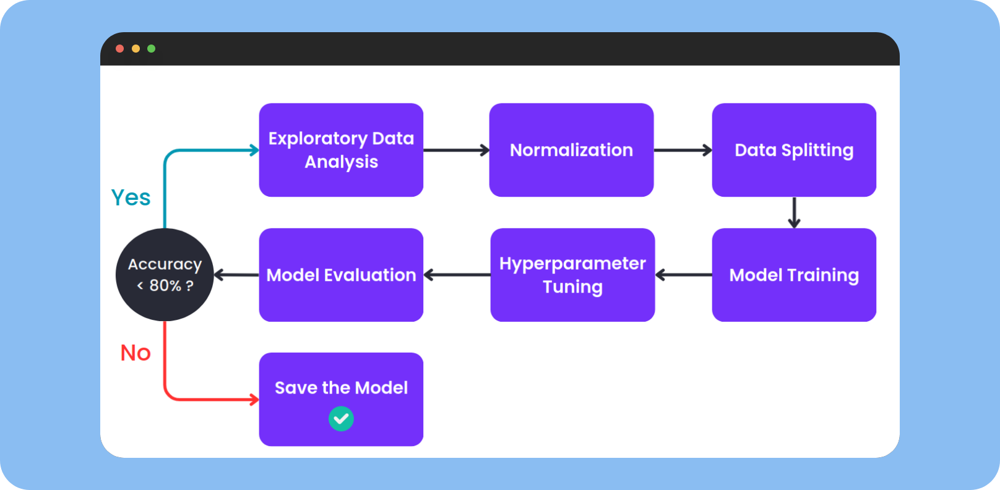

## Requirements

- Python version 3.10

## Prerequisites

- Pandas
- Numpy
- Scikit-learn
- Joblib

## Description

This project was created to make predictions on binary classification problems using KNN. The given dataset has 2 sheets: the **train sheet** which is used to train the model, and the **test sheet** which is used to test the model where the value of the target column y is hidden. This dataset consists of feature columns (x1, x2, and x3) and target column (y).

## How to Run?

- Install the required libraries in the requirements mentioned above

```
pip install numpy pandas scikit-learn joblib
```

- Open the .ipynb file with supported text editor
- Simply run the code.

## Notes:

- Make sure that the path to import the dataset is correct
- Also make sure the folder path to export the dataset is correct
- I also included the markdown text for each step of workflow.

> Tested on Linux Ubuntu 22.04 x86_64 and Windows 11 64 bit
